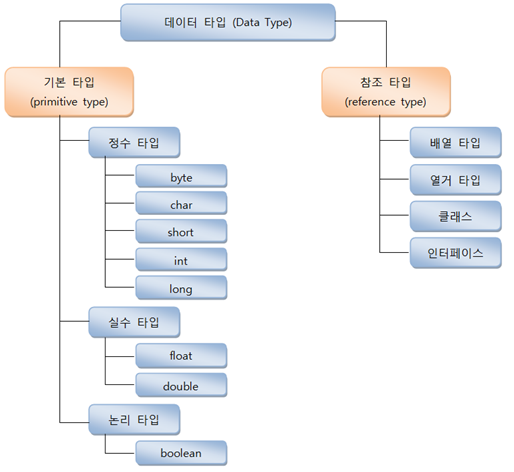

# 참조타입
## 1. 데이터 타입 분류

- 기본타입의 변수는 실제 값을저장한다
- 참조타입의 변수는 메모리 주소값을 저장한다
## 2. String 타입
```
String 변수;
변수 = "문자열";
```
    String 변수 = "문자열";
```
String 변수 = new String("문자열");
```
## 3. 배열 타입
```
타입[] 변수;
타입 변수[];
```
```
데이터타입[] 변수 = {값, 값, 값};
```
```
타입[] 변수 = new 타입[길이];
```
```
타입[] 변수 = null;
변수 = new 타입[길이];
```
```
타입[][] 변수 = {{값,값,...},{값,값,...},...};
타입[][] 변수 = new 타입[길이][길이]
```